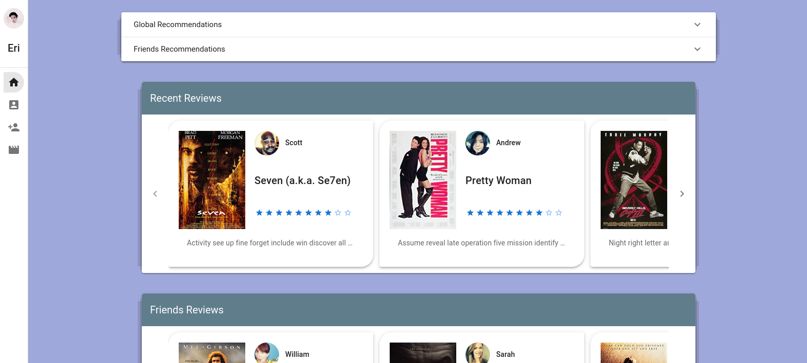
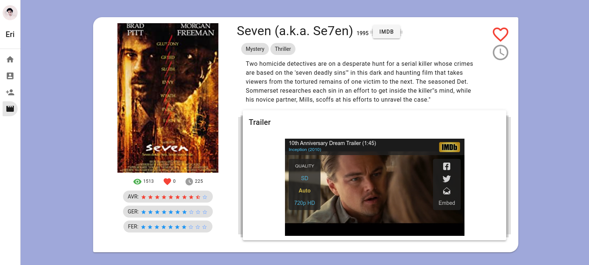
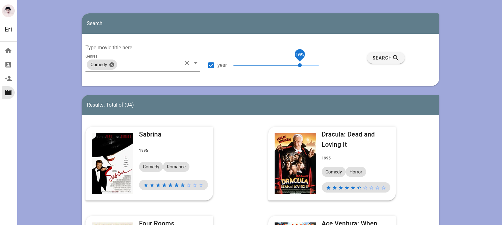
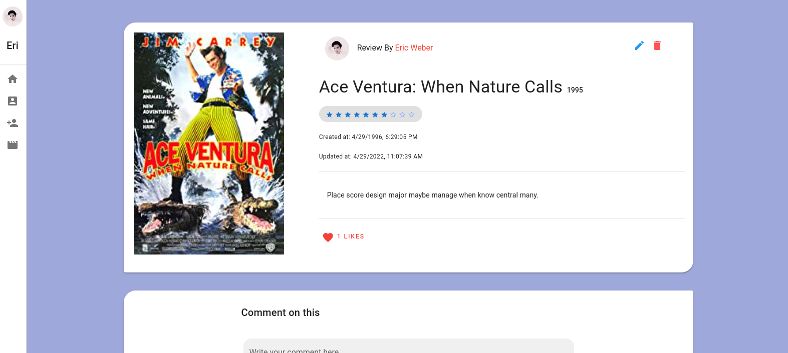
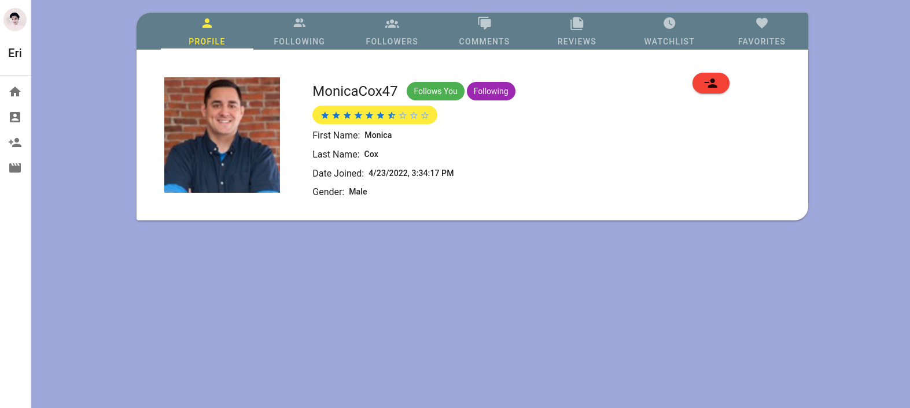

# Cinema Social Media with Recommendation System

## Technologies

list of technologies that has been used in this project.

### Backend

- Django: Server
- Postgresql: Database
- Celery: Task Manager for handling periodic tasks that generate required data
- Redis: Message Broker for Celery
- djangorestframework: API

### Frontend

- VueJs V2: Client App
- Vuex: State Management
- Vue-Router: Vue Router!
- Vuetify:  UI Library with beautifully handcrafted Material Components

## Algorithms

In this project the recommender systems has been implemented using **collabrative filtering**. Similarity Score between uesrs and between movie calculated using **Pearson Correlation Coefficient**.

## Features

In this project two instance of recommender has been implemented.

- global recommender: uses the **user's ratings** to calculate its data
- friends recommender: uses the **user's friends' ratings** to calculate its data

each have a set of features:

- Global
  - Recommendation List: list of 10 top movies based on Estimated Rating
  - Movie Estimated Rating: based on user's ratings
  - Similar Movies: list of 10 most similar movies
  - User Taste Group: list of 100 people with most similar taste to the user
- Friends
  - Recommendation List: list of 10 top movies base on Estimated Rating
  - Movie Estimated Rating: based on user's freinds' ratings

## Screenshots

for more visit [here](screenshots/)

### Home Page

here you can see two list of recent reviews.
and also two panels for list of recommendation from each recommender.

### Movie Page

here you can see movie details, add a review or view list of others reviews for this movie.

### Movies List

here you can search and filter list of all the movies in site.

### Reviews Page

in this page you can view details of a review, edit it if its your, comment on it or reply to other comments.

### Users Profile

here you can view users info.

